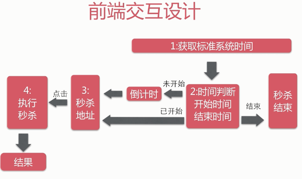
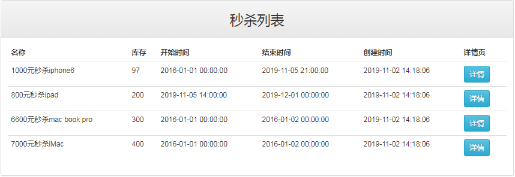

* content
{:toc}
### 秒杀系统数据库设计

```sql
-- 数据库初始化脚本

-- 创建数据库
CREATE DATABASE seckill;
-- 使用数据库
use seckill;
CREATE TABLE seckill(
  `seckill_id` BIGINT NOT NUll AUTO_INCREMENT COMMENT '商品库存ID',
  `name` VARCHAR(120) NOT NULL COMMENT '商品名称',
  `number` int NOT NULL COMMENT '库存数量',
  `create_time` TIMESTAMP NOT NULL DEFAULT CURRENT_TIMESTAMP COMMENT '创建时间',
  `start_time` TIMESTAMP  NOT NULL COMMENT '秒杀开始时间',
  `end_time`   TIMESTAMP   NOT NULL COMMENT '秒杀结束时间',
  PRIMARY KEY (seckill_id),
  key idx_start_time(start_time),
  key idx_end_time(end_time),
  key idx_create_time(create_time)
)ENGINE=INNODB AUTO_INCREMENT=1000 DEFAULT CHARSET=utf8 COMMENT='秒杀库存表';

-- 初始化数据
INSERT into seckill(name,number,start_time,end_time)
VALUES
  ('1000元秒杀iphone6',100,'2016-01-01 00:00:00','2016-01-02 00:00:00'),
  ('800元秒杀ipad',200,'2016-01-01 00:00:00','2016-01-02 00:00:00'),
  ('6600元秒杀mac book pro',300,'2016-01-01 00:00:00','2016-01-02 00:00:00'),
  ('7000元秒杀iMac',400,'2016-01-01 00:00:00','2016-01-02 00:00:00');

-- 秒杀成功明细表
-- 用户登录认证相关信息(简化为手机号)
CREATE TABLE success_killed(
  `seckill_id` BIGINT NOT NULL COMMENT '秒杀商品ID',
  `user_phone` BIGINT NOT NULL COMMENT '用户手机号',
  `state` TINYINT NOT NULL DEFAULT -1 COMMENT '状态标识:-1:无效 0:成功 1:已付款 2:已发货',
  `create_time` TIMESTAMP NOT NULL COMMENT '创建时间',
  PRIMARY KEY(seckill_id,user_phone),/*联合主键*/
  KEY idx_create_time(create_time)
)ENGINE=INNODB DEFAULT CHARSET=utf8 COMMENT='秒杀成功明细表';
```


### DAO

- 库存DAO
  - 减库存：如果当前时间在商品的秒杀开始时间和结束时间之间，并且秒杀id相等的话就可以进行秒杀，库存量减一
  - 根据id查询秒杀对象
  - 根据范围查询秒杀商品列表
- 明细DAO:
  - 插入购买明细，可过滤重复，同一个手机号只能对一个商品秒杀一次
  - 根据id和手机号查询明细信息和库存信息

### service

- 查询所有秒杀记录：直接调用库存dao的【根据范围查询秒杀商品列表】
- 查询单个秒杀记录：调用库存dao的【根据id查询秒杀对象】
- 暴露秒杀商品信息：秒杀开启时输出秒杀接口地址（携带MD5，当秒杀时需要传到后台，防止恶意秒杀），否则输出系统时间和秒杀时间
- 执行秒杀操作：使用spring声明式事务。
  - 验证用户传的MD5是不是服务器发送的那个，防止恶意秒杀
  - 减库存，如果没有更新到记录，表示秒杀结束
  - 记录购买行为，如果无法插入则视为重复秒杀
  - 秒杀成功，返回秒杀产品信息

### web

#### URL设计

- Get/seckill/list：秒杀列表
- Get/seckill/{id}/detail：详情页
- Get/seckill/time/now：系统时间
- POST/seckill/{id}/exposer：暴露秒杀信息
- POST/seckill/{id}/{md5}/execution：执行秒杀

### 前端页面

- 交互



- 商品列表页



- 商品详情页
  - 在cookie中查找手机号，验证手机号
  - 没有填写手机号弹出模态框要求填写手机号
  - 填写完手机号，向后台发送请求，获取服务器当前时间，进行计时操作
  - 进行计时操作，如果当前系统时间大于秒杀结束时间，秒杀结束；如果当前时间小于秒杀开始时间，进行倒计时显示；倒计时结束后可以进行秒杀。
  - 进行秒杀：发送请求从后台获取该商品的秒杀信息，如果已经开始秒杀，发送秒杀请求进行秒杀。否则重新进行倒计时


### 并发优化

#### Redis优化地址暴露接口

- 因为当秒杀倒计时时间结束时会向后台请求秒杀的商品信息，当成千上万人在等待倒计时结束时会产生很大的并发量

- 使用Redis缓存秒杀商品对象，并且采用性能最好的protostuff来自定义序列化对象，使对象占用最少的空间
- com.qinfen.dao.cache.RedisDao
- 在spring-dao.xml中注册RedisDao
- 在com.qinfen.service.impl.SeckillServiceImpl#exportSeckillUrl中优化暴露商品地方方法

#### 秒杀操作优化

- 当执行秒杀操作时：update减库存（rowLock行级锁） ---》网络延迟+GC ---》 insert购买明细 ---》 网络延迟+GC ---》 commit/rollback
- 目的就是为了缩短加行级锁到释放行级锁的时间
- com.qinfen.service.impl.SeckillServiceImpl#executeSeckill（调整update和insert的顺序，缩短持有行级锁的时间）

#### 使用存储过程优化秒杀

- 为了减少java客户端到mysql的sql传输执行延迟，我们把一个事务操作写成一个存储过程放在mysql客户端进行执行，会大大提高效率，降低延迟
- 存储过程优化:事务行级锁持有的时间
- 不要过度依赖存储过程
- 简单的逻辑依赖存储过程
- 定义存储过程

```sql
-- 秒杀执行储存过程
DELIMITER $$ -- 将定界符从;转换为$$
-- 定义储存过程
-- 参数： in输入参数   out输出参数
-- row_count() 返回上一条修改类型sql(delete,insert,update)的影响行数
-- row_count:0:未修改数据 ; >0:表示修改的行数； <0:sql错误
CREATE PROCEDURE `seckill`.`execute_seckill`
  (IN v_seckill_id BIGINT, IN v_phone BIGINT,
   IN v_kill_time  TIMESTAMP, OUT r_result INT)
  BEGIN
    DECLARE insert_count INT DEFAULT 0;
    START TRANSACTION;
    INSERT IGNORE INTO success_killed
    (seckill_id, user_phone, state)
    VALUES (v_seckill_id, v_phone, 0);
    SELECT row_count() INTO insert_count;
    IF (insert_count = 0) THEN
      ROLLBACK;
      SET r_result = -1; -- 重复秒杀
    ELSEIF (insert_count < 0) THEN
        ROLLBACK;
        SET r_result = -2; -- 系统错误
    ELSE
      UPDATE seckill
      SET number = number - 1
      WHERE seckill_id = v_seckill_id
            AND end_time > v_kill_time
            AND start_time < v_kill_time
            AND number > 0;
      SELECT row_count() INTO insert_count;
      IF (insert_count = 0) THEN
        ROLLBACK;
        SET r_result = 0;
      ELSEIF (insert_count < 0) THEN
          ROLLBACK;
          SET r_result = -2;
      ELSE
        COMMIT;
        SET r_result = 1;
      END IF;
    END IF;
  END;
$$
-- 储存过程定义结束
-- 将定界符重新改为;
DELIMITER ;

-- 定义一个用户变量r_result
SET @r_result = -3;
-- 执行储存过程
CALL execute_seckill(1003, 13502178891, now(), @r_result);
-- 获取结果
SELECT @r_result;

```

- com.qinfen.dao.SeckillDao#killByProcedure（mybatis调用存储过程执行秒杀）
- com.qinfen.service.SeckillService#executeSeckillProcedure（service层）
- com.qinfen.web.SeckillController#execute（controller层）

